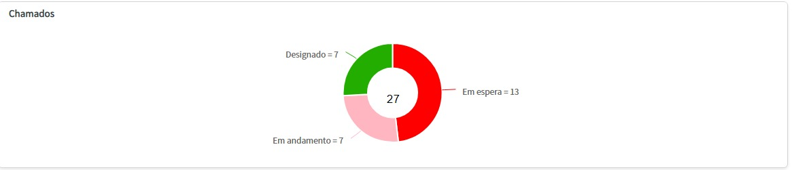
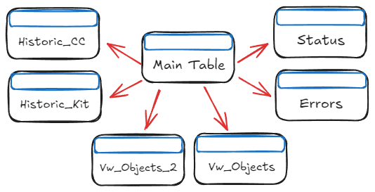
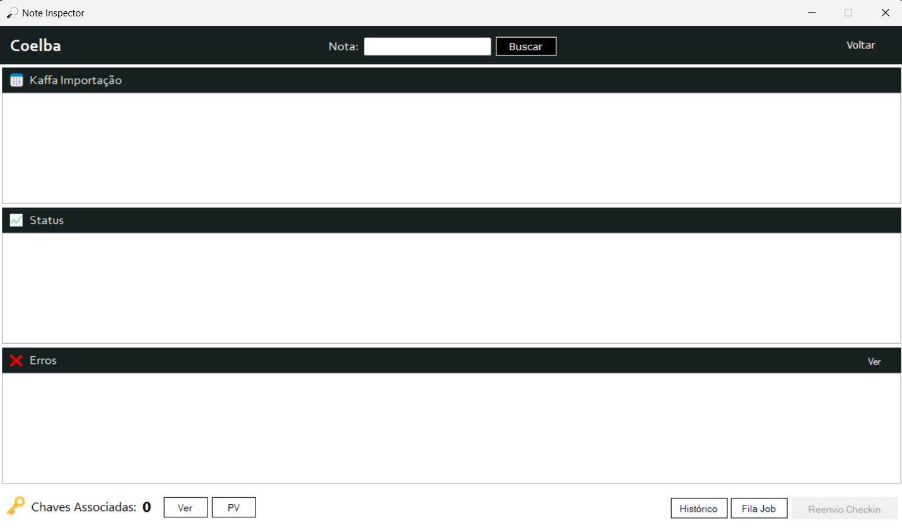

# Sobre o projeto

O Note Inspector é uma ferramenta de análise e automação de processos que desenvolvi durante meu período de estágio na Codex Utilities, 
no setor de AMS (Application Management Services). Seu principal objetivo é otimizar os processos, 
aumentando tanto a eficiência quanto a assertividade na resolução dos incidentes. <br>
<br>
Posteriormente, a ferramenta foi amplamente adotada pela empresa, tornando seu uso imprescíndivel no setor.

# Por quê?

No setor de Application Management Services, somos responsáveis pelo atendimento e pela resolução de incidentes relacionados às nossas duas principais aplicações. Nesse contexto, 
a agilidade e a precisão são imprescíndiveis, pois trabalhamos com prazos específicos para a resolução de problemas e precisamos garantir que as soluções sejam implementadas da forma mais eficaz possível.
<br>
<br>
<p align="center">
  
</p>
<p align="center">
    <em>Exemplo de uma fila de incidentes (em um dia calmo)</em>
</p>

# Antes do Note Inspector

Ao lidar com incidentes, é necessário realizar uma investigação detalhada das causas. Isso é feito por meio de consultas ao banco de dados da empresa, a partir do qual o projeto em questão se originou.
Utilizamos uma tabela principal que fornece os dados necessários para navegar entre outras tabelas, permitindo uma análise completa do projeto e possibilitando a execução das ações corretivas.

Porém, todo esse processo era feito de forma manual através de consultas <ins>tabela por tabela</ins>.
<br>
<br>
<p align="center">
  
</p>
<p align="center">
    <em>Acessando as Tabelas</em>
</p>

```
Início da investigação

  - [Main Table]   : SELECT utilizando o número da nota recebido no Incidente
  - [Status]       : SELECT utilizando o ID de Projeto da [Main Table], removendo os 3 primeiros dígitos
  - [Erros]        : SELECT utilizando o ID de Projeto da [Main Table], removendo os 3 primeiros dígitos
  - [VW_Objects]   : SELECT utilizando o Numero do Pacote da [Main Table]
  - [VW_Objects_2] : SELECT utilizando o Numero do Pacote da [Main Table]
  - [Historic_CC]  : SELECT utilizando o Código de Projeto CC da [Main Table]
  - [Historic_Kit] : SELECT utilizando o Código de Projeto KIT da [Main Table]

Tomada de Ação
```
<br>
Isso tornava o processo extremamente lento, especialmente quando havia uma grande quantidade de incidentes na fila ou quando um incidente era particularmente complexo, exigindo uma investigação mais aprofundada que envolvia a consulta a várias outras tabelas além das principais.

# Note Inspector

O Note Inspector automatiza essas buscas, apresentando todas as informações essenciais de forma visual na tela, de uma só vez. Isso permite uma tomada de decisão mais ágil e eficaz, eliminando a possibilidade de erro humano na coleta de dados durante a navegação entre as tabelas.
<p align="center">
  
</p>

# Tecnologias Utilizadas

  - C#
  - .NET Framework 4.7.2
  - Windows Forms

# Autor

Lucas Campos® 
<br>
https://www.linkedin.com/in/lucascamposdev/
